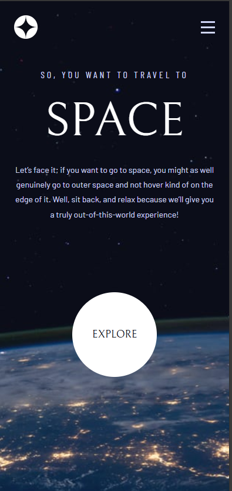
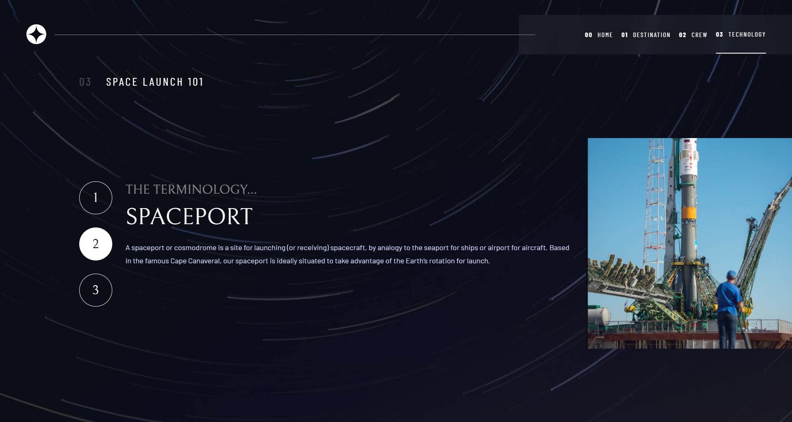
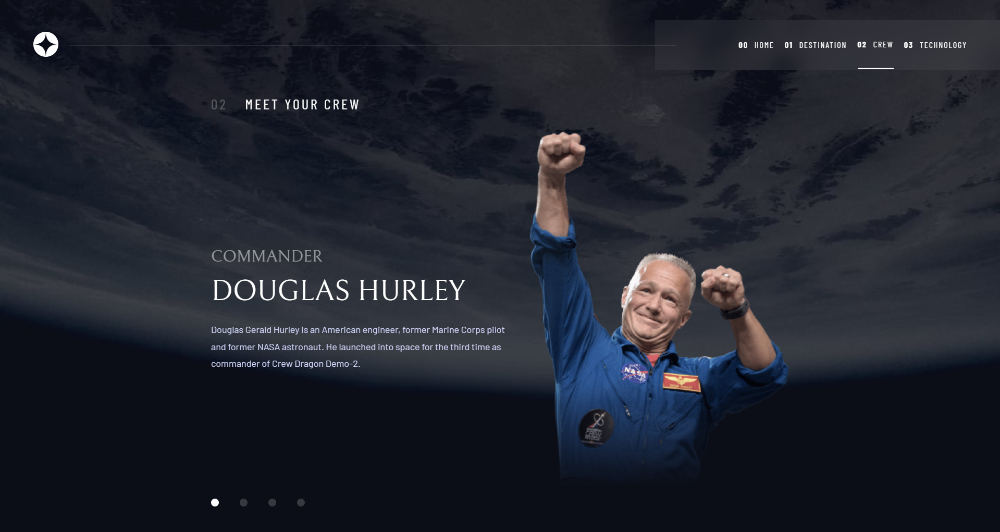
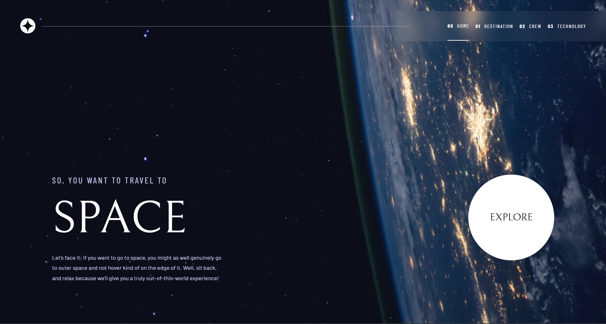
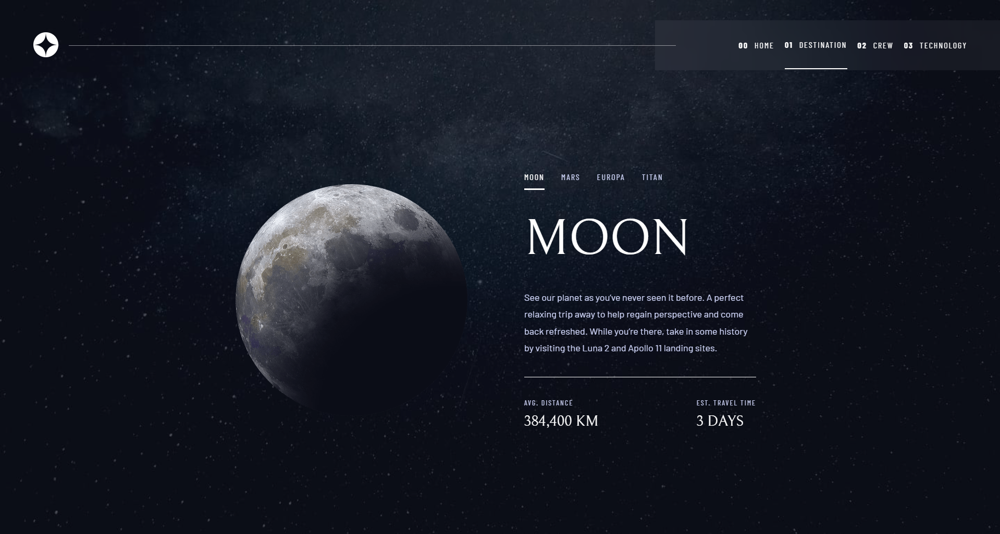

# Frontend Mentor - Space tourism website solution

This is a solution to the [Space tourism website challenge on Frontend Mentor](https://www.frontendmentor.io/challenges/space-tourism-multipage-website-gRWj1URZ3). Frontend Mentor challenges help you improve your coding skills by building realistic projects.

## Table of contents

- [Overview](#overview)
  - [The challenge](#the-challenge)
  - [Screenshot](#screenshot)
  - [Links](#links)
- [My process](#my-process)
  - [Built with](#built-with)
  - [What I learned](#what-i-learned)
  - [Continued development](#continued-development)
  - [Useful resources](#useful-resources)
- [Author](#author)
- [Acknowledgments](#acknowledgments)

## Overview

### The challenge

Users should be able to:

- View the optimal layout for each of the website's pages depending on their device's screen size
- See hover states for all interactive elements on the page
- View each page and be able to toggle between the tabs to see new information

### Screenshot

Add a screenshot of your solution. The easiest way to do this is to use Firefox to view your project, right-click the page and select "Take a Screenshot". You can choose either a full-height screenshot or a cropped one based on how long the page is. If it's very long, it might be best to crop it.

Alternatively, you can use a tool like [FireShot](https://getfireshot.com/) to take the screenshot. FireShot has a free option, so you don't need to purchase it.

Then crop/optimize/edit your image however you like, add it to your project, and update the file path in the image above.

### Links

- Solution URL: 
- Live Site URL: 

## My process

### Built with

- Semantic HTML5 markup
- CSS custom properties
- Flexbox
- CSS Grid
- Mobile-first workflow
- [React](https://reactjs.org/) - JS library
- [Vite](https://vitejs.dev/) - Build tool
- CSS Modules - For styles

### What I learned

While working on this project, I:

✅ Learned how to write styles using CSS Modules, which helps avoid class conflicts and keeps the code more organized.

Example of using a CSS Module:

/_ styles/Button.module.css _/
.button {
background-color: blue;
color: white;
padding: 10px 20px;
border-radius: 5px;
}

// components/Button.js
import styles from "../styles/Button.module.css";

export default function Button() {
return <button className={styles.button}>Click me</button>;
}
✅ Strengthened my knowledge of React hooks:

useState – for managing state.

useEffect – for handling side effects (e.g., detecting clicks outside an element).

This project helped me better understand modular styling and React hooks, making my code cleaner and more efficient. 🚀

### Continued development

In the future, I want to continue working with styling in React, exploring different approaches such as:

Styled Components for component-based styling.

Tailwind CSS for utility-first styling.

Global styles with CSS-in-JS solutions.

Additionally, for my next project, I plan to start learning Next.js to improve my skills in server-side rendering (SSR) and static site generation (SSG). 🚀

### Useful resources

## Author

- Website - [Didar Aizharyk](https://www.instagram.com/d.aizharyk/?__pwa=1)
- Frontend Mentor - [@daizharyk](https://www.frontendmentor.io/profile/daizharyk)

## Acknowledgments

thank you Ghat GPT .
